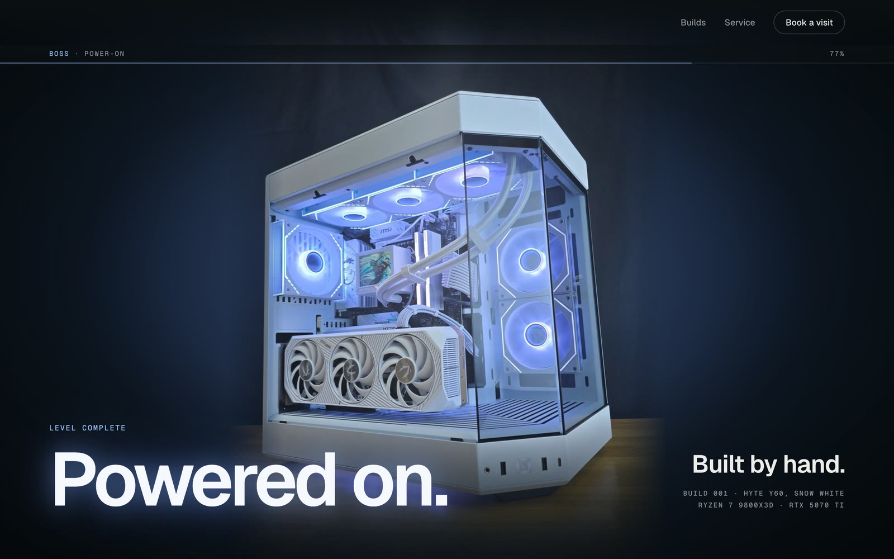
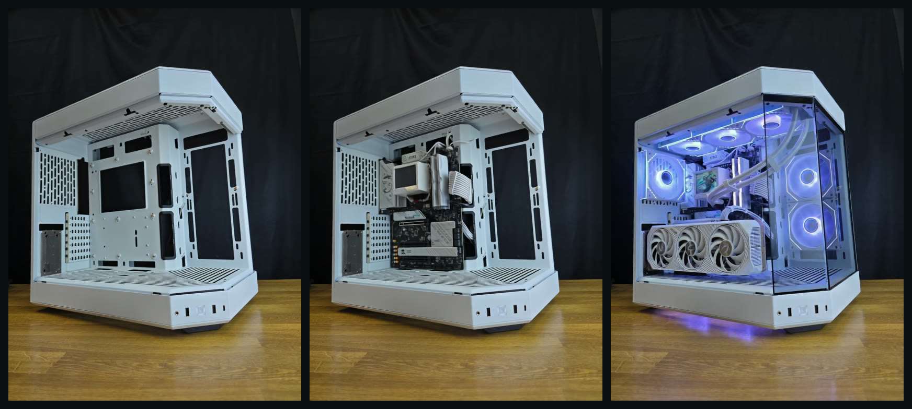
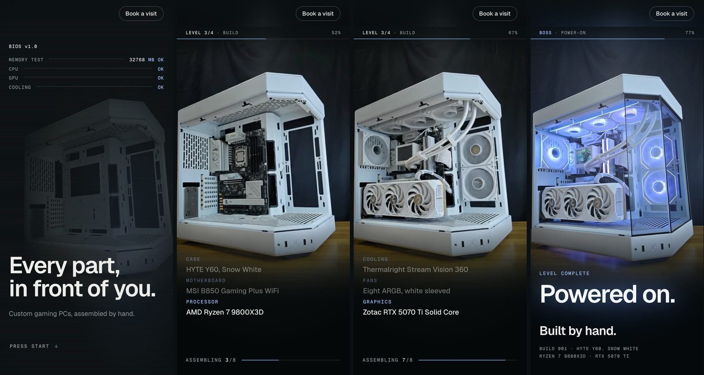
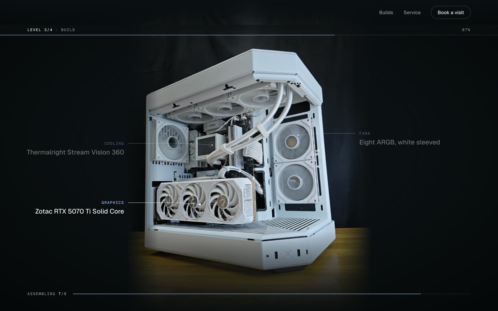
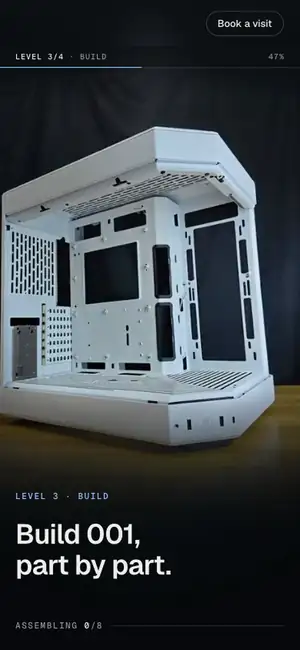

# Henry's scroll-craft

**One real photo, played backwards, becomes a website.**

A Claude Code skill that turns a local business's best photo into a
scroll-driven website. You scroll, their product builds itself part by part, it
switches on, and the last frame is their real photo.

[](LICENSE)
[](plugins/henry/skills/henry-scroll-craft/SKILL.md)



*Concept built for a Singapore PC shop in Cooked or Cracked Ep6. Not affiliated with the shop.*

---

## What it does

- **Asks you eight short questions** about the business: vibe, journey, the one
  moment, what no other site does, the hero photo, the close. You can answer
  "you decide" to any of them.
- **Designs the page in Figma** through the Figma connector, from the shop's own
  photos. Optional.
- **Writes the video prompt for you.** One prompt, one photo, one 8-second clip
  on the video model you already use.
- **Builds the page** on Nate Herk's scroll engine. The clip plays backwards
  under the scroll, a label draws in for each part on the exact frame it goes in,
  and the product powers on at the end.
- **Shows their real work.** Their other products, their public facts, and one
  WhatsApp or booking button.
- **Checks itself.** Screenshots on desktop, phone and reduced motion, and a
  report of any scroll that changes nothing on screen.

It is built for businesses with great photos and no website: a PC builder, a
bike shop, a furniture maker, a café.

## The trick: one photo, played backwards



*Concept built for a Singapore PC shop in Cooked or Cracked Ep6. Not affiliated with the shop.*

1. Take the shop's own photo of a finished product.
2. Ask a video model for a **teardown** of it: the lights go off, then the parts
   lift out one by one until the case is empty.
3. Play that clip **backwards** under the scroll.

A video model starts from the photo you give it. So the teardown's first frame
is their real photo. Played backwards, that frame is the last thing the visitor
sees. Ask the model to build it forwards instead and the last frame is the
model's guess.



*Concept built for a Singapore PC shop in Cooked or Cracked Ep6. Not affiliated with the shop.*

## Install

### Claude desktop app (Code tab)

`/plugin` does not work in the desktop app's Code tab. Type this instead:

```text
install the skill from github.com/EasyAIHenry/henry-scroll-craft into my personal Claude skills, then check what it needs and install what is missing
```

Claude copies `plugins/henry/skills/henry-scroll-craft` into
`~/.claude/skills/henry-scroll-craft`, runs the check, and tells you what is
missing. Then start a build with:

```text
/henry-scroll-craft Build [Figma link] as a scroll website for [shop]
```

### Claude Code in the terminal

```bash
/plugin marketplace add EasyAIHenry/henry-scroll-craft
```
```bash
/plugin install henry@easyaihenry
```

Then:

```text
/henry:henry-scroll-craft
```

If the install says `Run /reload-plugins to activate.`, run that.

## Copy these three asks

Fill the brackets. Use `/henry-scroll-craft` if you installed it as a personal
skill, or `/henry:henry-scroll-craft` if you installed the plugin.

**1. The design (in Claude)**

```text
/henry-scroll-craft Design a scroll website for [shop name], a [what they sell] in [area]. Their photos are in [folder or Instagram handle]. Use [hero photo] as the finished product. Draw it in Figma first: a dark page that matches their photo backdrop, one accent colour from the product, their real builds, their public facts, and one [WhatsApp / booking] button.
```

**2. The clip (in your video model, with the hero photo attached)**

```text
Locked-off static camera with the exact framing of the reference photo: [the finished product, colour and model] on [the surface] against [the backdrop]. Clean product teardown in reverse build order, stop-motion style, no hands, no people. First, [the lights / screen / steam] switches off. Then [the outermost part] lifts off and out of frame. [Next part] lifts out. [Next part] lifts out. The [bare shell] is left completely empty and still on [the surface]. Photoreal, sharp, consistent lighting, no camera movement, no text.
```

Settings: 8 seconds, same aspect ratio as the photo, cheapest draft resolution
first. Save it as `clip.mp4`.

**3. The build (back in Claude)**

```text
/henry-scroll-craft Build [Figma link] as a scroll website for [shop]. Play [clip.mp4] backwards under the scroll. Show a label for each part on the frame it goes in, switch [the lights] on at the end, then fade to their real photo. Then their real [builds / products], the facts from [source], and one [WhatsApp / booking] button. Make it seamless and premium. Check desktop, phone and reduced motion.
```

## What you need

| You need | For | Notes |
|---|---|---|
| **Claude Code** | Running the skill | The desktop app's Code tab or the terminal |
| **Node 18+** | The scripts | |
| **A full ffmpeg build** | Reversing and encoding the clip | Some apps put a cut-down ffmpeg on your PATH. The check finds a full one if you have it. |
| **Google Chrome** | The screenshot checks | The skill installs `playwright-core` in the build folder itself |
| **An image-to-video model** | The one generated clip | Any model that takes a start image works, for example Seedance 2.5 on Higgsfield, or Kling (untested). Paid on most plans. |
| **Figma connector** | The design step | Optional. In the Claude app: Customize > Connectors > + > Figma > Connect. |

The skill's first check lists what is missing. It does not install anything
itself. Ask Claude to install what it lists.

Built and checked on macOS.

## Example: a PC shop with no website



*Concept built for a Singapore PC shop in Cooked or Cracked Ep6. Not affiliated with the shop.*

The shop had hundreds of five-star Google reviews, an Instagram full of studio
shots of their builds, and no website.

| Step | What happened |
|---|---|
| Design | Claude drew the page in Figma from their photos. 5 minutes. |
| Clip | Seedance 2.5, 8 seconds, 480p draft, one photo of their white PC. Worked first try. Render took about 1 minute 20 seconds. Under US$1. |
| Build | About 10 minutes. Eight part labels, each timed to the frame its part goes in. |
| Check | Desktop, phone and reduced motion. No dead scroll. |
| Total | About 18 minutes from an empty Figma file to a recorded site. |

The first pass looked tacky. One more ask, "make it seamless and premium",
fixed most of it: the page colour matched to their photo backdrop, one accent
colour, and film grain to tie the AI clip and the real photos together.

The pictures on this page are from a second design pass, done after the timed
test and not counted in the 18 minutes: one type family (Geist), the build full
screen, a thin line from each part to its label, and a light sweep when it
powers on. The rules are in
[figma-design.md](plugins/henry/skills/henry-scroll-craft/references/figma-design.md).



*Concept built for a Singapore PC shop in Cooked or Cracked Ep6. Not affiliated with the shop.*

## Honesty rules

A concept site for a real business has to be honest about what it is. The
skill follows these and so should you:

- **Say it is a concept.** Every page carries `Concept by <you>. Not affiliated with <business>.` until the owner signs off.
- **Never invent numbers.** No made-up stats, reviews, quotes or prices.
- **Use only their material.** Their own photos and their public facts, each
  with a source and a date.
- **The clip is the only AI media,** and it ends on their real photo.
- **Ask the owner before you publish** or send the link to anyone else.
- **Business details only.** Nothing personal about the owner.

If anyone asks, the build clip is AI. The parts inside may not match their real
build exactly. The final frame is their photo.

## What is in here

```
plugins/henry/skills/henry-scroll-craft/
├── SKILL.md                     the workflow: brief, design, clip, build, verify, honesty
├── references/
│   ├── local-business-brief.md  the eight questions, picking the hero photo, BRIEF.md template
│   ├── reverse-teardown.md      the prompt template, settings, three more examples
│   ├── figma-design.md          the Figma step and both design passes
│   ├── page-order.md            the feeling curve and the section order
│   ├── sync-to-clip.md          labels timed to the clip, the switch-on, the real photo
│   ├── devices.md               the engine's scroll devices (Nate Herk)
│   ├── verify.md                the full check procedure (Nate Herk)
│   ├── taste.md                 spacing, type and contrast rules (Nate Herk)
│   ├── template.html            starting HTML (Nate Herk)
│   └── device-diag.html         phone debugging page (Nate Herk)
├── engine/                      scrollcraft.js and .css (Nate Herk, unchanged)
├── scripts/                     doctor, workspace, encode, serve, shoot (Nate Herk)
└── templates/FINGERPRINTS.md    optional build registry (Nate Herk)
```

[NOTICE.md](NOTICE.md) lists exactly what came from Nate's repository and what
changed.

## Seen in Cooked or Cracked

Cooked or Cracked is Henry Chua's Reels series that tests viral AI claims on
camera. Episode 6 tested Nate Herk's claim that Claude Code and Seedance can
build sites like this. This repository is what came out of it.

---

Built on [Nate Herk's scroll-craft](https://github.com/nateherkai/scroll-craft) (MIT).
Adapted by Henry Chua. MIT licence, see [LICENSE](LICENSE).
